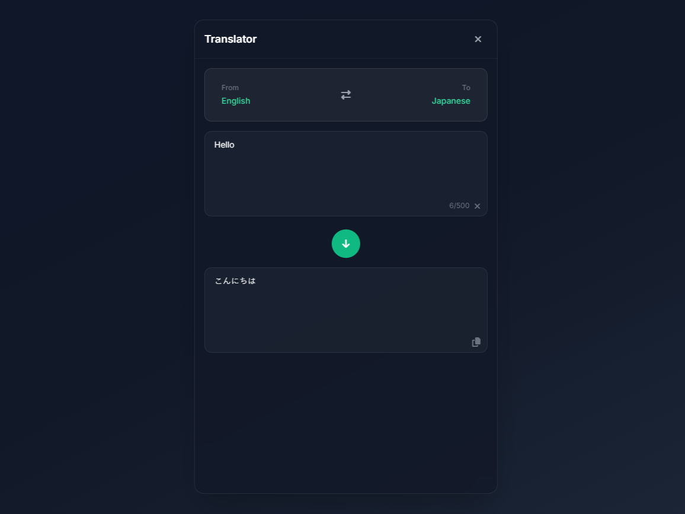
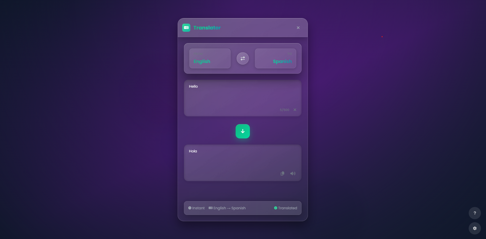

# 🌐 Translator React Vite Web App

A lightweight and intuitive web-based language translator built with **React**, **Vite**, and **Tailwind CSS**. Powered by the **MyMemory Translation API**, this app allows users to seamlessly translate text between multiple languages in both directions.

🔗 **Live Demo**: https://scintillating-frangollo-770008.netlify.app/




---

## 🚀 Features

- 🌍 Translate between a wide range of languages
- 🔁 Bi-directional translation (reverse support)
- 🎨 Fully responsive UI with Tailwind CSS
- ⚡ Fast development with Vite
- 📋 Copy translated output easily

---

## 🛠️ Tech Stack

- **Frontend**: React + Vite
- **Styling**: Tailwind CSS
- **Translation API**: MyMemory API
- **Deployment**: Netlify

---

## 📦 Installation & Setup

1. **Clone the repository**
   ```bash
   git clone https://github.com/Hacknova49/Language-Translator.git
   cd Language-Translator
   ```

2. **Install dependencies**
   ```bash
   npm install
   ```

3. **Start the development server**
   ```bash
   npm run dev
   ```

4. **Open in your browser**
   ```
   http://localhost:5173/
   ```

---

## ⚙️ Configuration

This app uses the [MyMemory Translation API](https://mymemory.translated.net/doc/spec.php). No API key is required for basic usage.

If you plan to use a paid or premium translation service, update the fetch URL accordingly in the project’s source files (likely `App.jsx` or a related utility).

---

## 📁 File Structure Overview

```
Language-Translator/
├── public/                 # Static assets
├── src/
│   ├── components/         # Reusable UI components
│   ├── App.jsx             # Main application logic
│   └── main.jsx            # Entry point
├── index.html              # Main HTML file
├── tailwind.config.js      # Tailwind CSS configuration
├── vite.config.js          # Vite config
└── package.json            # Dependencies and scripts
```

---

## 📷 Screenshots

| Home Page                             | Translation Feature                       |
|--------------------------------------|-------------------------------------------|
|  |  |

---


## 🤝 Contributing

Contributions, issues, and feature requests are welcome!

1. Fork this repo
2. Create your feature branch (`git checkout -b feature/YourFeature`)
3. Commit your changes (`git commit -m 'Add feature'`)
4. Push to the branch (`git push origin feature/YourFeature`)
5. Open a pull request

---

## 📄 License

This project is open-source and available under the MIT License.

---

## 👨‍💻 Author

Developed by [Hacknova49](https://github.com/Hacknova49)
